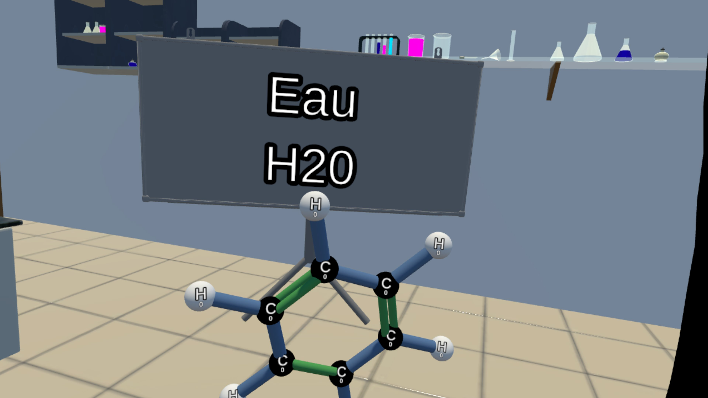
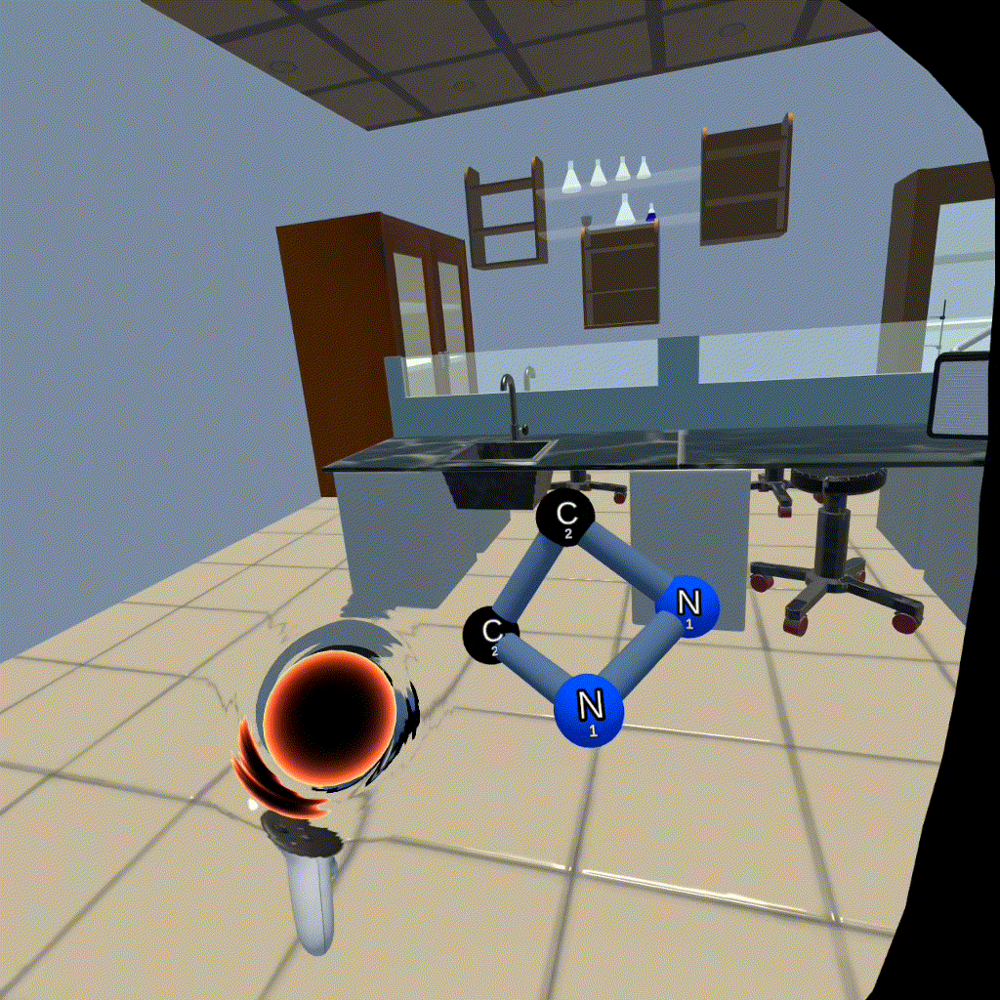

# VRChem - Apprendre la chimie moléculaire en réalité virtuelle



## Table des matières

- [Introduction](#introduction)
- [Problématique et solution](#problématique-et-solution)
- [Fonctionnalités principales](#fonctionnalités-principales)
- [Aspects techniques](#aspects-techniques)
- [Tests utilisateurs](#tests-utilisateurs)
- [Résultats](#résultats)
- [Améliorations futures](#améliorations-futures)
- [Installation](#installation)
- [Équipe](#équipe)
- [Liens](#liens)

## Introduction

Ce projet a été réalisé dans le cadre du cours de Développement logiciel en réalité étendue (LOG8704) à l'automne 2025.
Notre objectif était d'explorer comment la réalité virtuelle peut servir l'enseignement des sciences et plus précisément en se concentrant sur la chimie moléculaire.

Les étudiants qui découvrent la chimie ont souvent de la difficulté à s'imaginer ce qu'il se produit lorsque des éléments fusionnent ou des molécules se séparent parce qu'il faut comprendre des phénomènes invisibles et visualiser des structures tridimensionnelles complexes.
Les méthodes traditionnelles utilisent des schémas plats et des équations abstraites, ce qui peut frustrer et diminuer l'intérêt des étudiants qui ont une méthode d'apprentissage visuel ou kinesthésique.

**VRChem** est une application pour le Meta Quest 3 qui permet d'apprendre les concepts de base de la chimie moléculaire à travers des défis interactifs.
L'application propose aux utilisateurs d'assembler, manipuler et transformer des molécules en utilisant huit atomes de base.
Nous avons privilégié une approche ludique et intuitive en mettant l'accent sur l'engagement et le plaisir d'expérimenter avec les molécules.

## Problématique et solution

### Le défi

Les modèles physiques comme les kits de molécules peuvent aider, mais ils ont une accessibilité limitée et un coût important pour les écoles si nous voulons avoir une grande variété d'atomes différents. De plus, un étudiant qui veut expérimenter avec différentes configurations moléculaires à la maison n'a souvent pas accès à ces outils.

### Notre approche

La réalité virtuelle offre une solution en permettant aux utilisateurs de manipuler directement des molécules virtuelles dans un espace tridimensionnel.
L'utilisateur peut voir la molécule sous tous les angles, la faire tourner dans ses mains, briser des liaisons et en créer de nouvelles.
Cette interaction directe crée une compréhension intuitive des concepts chimiques de base sans nécessiter d'équipement de laboratoire coûteux.

Notre application permet de transformer l'apprentissage de la chimie moléculaire en une expérience interactive accessible où les étudiants peuvent expérimenter directement avec les molécules et découvrir comment les atomes s'assemblent et interagissent.

## Fonctionnalités principales

### Manipulation des atomes et molécules


L'utilisateur peut saisir des atomes individuels et les manipuler dans l'espace 3D.
Chaque atome affiche un compteur indiquant le nombre de liaisons possibles, qui se met à jour automatiquement lors de la création de liens.
Les couleurs des atomes aident à bien différencier les éléments chimiques.

### Liaisons chimiques


Pour créer des liaisons, l'utilisateur approche simplement deux atomes compatibles.
Le système évalue automatiquement si une liaison est possible en fonction du nombre de liaisons disponibles pour chaque atome.
Des retours haptiques et visuels confirment la création réussie d'une liaison.
Les laisions one une physique élastique qui rends la manipulaiton ludique.
Les utilisateurs peuvent briser des liaisons existantes en étirant la molécule au-delà d'une distance seuil.

### Menu d'inventaire


Un menu intuitif accessible par le bouton "X" permet de faire apparaître de nouveaux atomes dans l'espace de travail.
Les huit atomes de base sont disponibles à tout moment, permettant une expérimentation libre et créative.

### Système de niveaux et objectifs

Chaque niveau présente un objectif spécifique, comme créer de l'eau (H₂O) en assemblant 2 atomes d'hydrogène et 1 atome d'oxygène.

### Corbeille (trou noir)



Suite aux retours des tests utilisateurs, nous avons ajouté une corbeille sous forme de trou noir pour supprimer les atomes indésirables.
Cette fonctionnalité répond à un besoin identifié lors des tests de jouabilité.

## Aspects techniques

### Plateforme et outils de développement

Le projet a été réalisé sur **Unity** avec l'aide d'**OpenXR** et du **Meta XR All-in-One SDK**.
Nous avons utilisé les Building Blocks fournis par Meta XR pour implémenter certaines fonctionnalités de base en VR.

**Plateforme cible**: Meta Quest 3

### Technologies principales

#### Camera Rig et interactions

- **Camera Rig**: Permet de suivre les mouvements du casque
- **Controller Tracking**: Suit les mouvements des manettes
- **Interactions Rig**: Gère la saisie d'objets dans la scène
- **Controller Buttons Mapper**: Attribue des actions aux boutons des manettes

#### Support des manettes et des mains


L'application se joue aussi sans manettes.
Nous avons ajouté des gestes personnalisés pour faire apparaître le menu et la corbeille, permettant une interaction naturelle avec les mains seules.

#### Système de locomotion

Pour se déplacer et s'orienter, l'utilisateur a accès au déplacement par joystick et à la rotation de la caméra sur l'axe horizontal.
Nous avons jugé que le déplacement par téléportation n'était pas pertinent pour notre application, car l'espace virtuel est très petit et le gameplay du jeu ne nécessite pas de se déplacer sur de longues distances.

**Protection contre la cinétose**: Pour le confort de l'utilisateur, nous avons intégré une œillère de protection lors des déplacements afin de le protéger contre la cinétose.
Cette œillère apparaît automatiquement lorsque l'utilisateur effectue un déplacement par joystick ou une rotation horizontale de la caméra.

#### Audio spatial

Le système d'audio spatial permet de faire provenir du son d'un endroit précis dans l'environnement virtuel.
Cette technologie est utilisée notamment pour la radio qui donne les instructions, créant une expérience immersive où le son semble réellement provenir d'un objet dans l'espace 3D.

#### Retours haptiques

Les retours haptiques dans les manettes permettent une expérience plus immersive et réaliste grâce aux vibrations.
Nous avons créé des Haptic Clips personnalisés en utilisant **Meta Haptics Studio**, qui se déclenchent lors d'actions importantes comme la création de liaisons ou la saisie d'atomes.

### Outils de développement

**Meta XR Simulator**: Durant le développement, nous avons utilisé le Meta XR Simulator pour tester l'application.
Cet outil a permis d'opérer facilement sur une seule machine et de pouvoir tester sur le casque une seule fois lorsque la fonctionnalité est complétée.
Au total, cinq tests ont été effectués en bâtissant le projet et l'envoyant sur le casque en mode développeur.

## Tests utilisateurs

Nous avons procédé à plusieurs phases de tests avec des utilisateurs pour recevoir des commentaires constructifs.
Ces tests ont été essentiels au développement et nous ont permis d'identifier plusieurs améliorations importantes.

### Retours clés et impacts

| Commentaire | Impact sur le projet |
|-------------|---------------------|
| Aucune façon de supprimer un atome | Ajout d'une corbeille sous forme de trou noir |
| Difficile de savoir le nombre de liens qu'un atome peut avoir | Ajout d'un compteur sur chaque atome qui se met à jour avec les liens créés |
| Le bouton de côté ("grip") pour attraper les molécules n'est pas intuitif | Ajout de la gâchette en plus du bouton de côté |
| La physique des molécules est amusante | Modification pour l'accentuer légèrement |

### Test avec un chimiste professionnel

**Profil**: Chimiste, première expérience VR

Étant donné ses connaissances en chimie, il a vite compris que les chiffres sur les atomes représentaient le nombre de liaisons possibles pour chaque atome.
Il a trouvé que les couleurs l'aidaient à bien différencier les atomes.
Cependant, il a eu plus de misère à s'adapter à la réalité virtuelle et aux différents contrôles.
Il avait de la difficulté à placer ses mains sur les manettes, étant donné qu'il ne voyait pas ses doigts et ses mains dans l'application.
Il a également déclaré qu'un schéma ou un guide pour apprendre les différents boutons serait pertinent, car il avait de la difficulté à se souvenir des boutons et de ce qu'ils faisaient.

### Test avec un joueur expérimenté

**Profil**: Étudiant à Polytechnique avec un intérêt pour le jeu vidéo

Il a eu de la difficulté à trouver comment créer des liens entre les atomes, mais, après avoir compris, il n'avait plus de difficulté.
Il s'est amusé à essayer de faire des molécules absurdement grandes et a été surpris que ça ne cause pas de problèmes.
Son approche était plus celle qu'on adopterait dans un jeu bac à sable jusqu'à ce qu'on l'informe des objectifs sur le tableau.
Il aurait toutefois aimé un peu plus de retours audio sur certaines actions, telles que la suppression d'atomes.

## Résultats

### Ce qui fonctionne bien

Plusieurs utilisateurs ont déclaré trouver l'expérience ludique et intuitive.
Ils ont eu du plaisir à simplement manipuler les molécules, qui possèdent une physique de rebondissement qu'ils ont appréciée.
Les mécaniques de création de liens et la physique liée à celle-ci se sont avérées plus amusantes que prévu initialement.

### Apprentissages du projet

**OVRCameraRig du MetaXR All-in-One SDK**: Un des points marquants de la réalisation de l'application est l'utilisation de ce building block.
Bien qu'il nous ait permis de rapidement avoir un squelette fonctionnel, il est très lourd en fonctionnalités, ce qui rend les fonctionnalités désirées difficiles à trouver en plus d'alourdir le projet. Si c'était à refaire, nous préférerions bâtir notre propre CameraRig minimal, avec uniquement les fonctionnalités désirées.

**Tests utilisateurs**: Les tests avec les utilisateurs nous ont été très utiles lors du développement de l'application.
En effet, sans recevoir des commentaires d'utilisateur extérieur à l'équipe, nous n'aurions jamais vu l'application sous un autre angle et nous aurions manqué des mécaniques toutes simples, mais logiques, comme la suppression des atomes.

**Parallélisation du travail**: Lors de la création de l'échéancier, nous pensions avoir des problèmes d'interdépendances des fonctionnalités qui ralentiraient le développement.
Toutefois, nous avons trouvé qu'il a été plutôt facile de paralléliser le travail de façon à avoir les quatre coéquipiers qui travaillent en même temps.

## Améliorations futures

### Tutoriel amélioré

Dans nos derniers tests, nous avons remarqué que les interactions nécessaires pour créer des liens n'étaient pas aussi claires que nous le pensions initialement.
Un tutoriel mieux guidé serait probablement nécessaire pour accueillir les nouveaux joueurs.

### Mode multijoueur

Nous souhaiterions ajouter la possibilité de jouer en multijoueur.
Cela améliorerait l'expérience, car elle deviendrait collaborative et dynamique. De plus, apprendre en groupe est plus amusant que d'apprendre seul.

### Mode stœchiométrie

Il s'agissait d'une fonctionnalité souhaitable que nous avions mise dans notre échéancier, mais que nous n'avons pas intégrée par faute de temps.
Cela permettrait de mettre à l'épreuve les connaissances de l'utilisateur en équilibrant des équations chimiques de part et d'autre d'un séparateur.

### Expérience ludique pure

Les mécaniques de création de liens et la physique sont plus amusantes que prévu initialement.
Plusieurs testeurs avaient plus de plaisir à jouer avec les molécules que de réaliser les objectifs.
C'est un bon signe que ce genre d'interaction serait intéressant à explorer dans un projet purement ludique et pourrait être poussé plus loin qu'un outil d'apprentissage de la chimie.

## Installation

### Prérequis

- Meta Quest 3
- Mode développeur activé
- Connexion USB ou sans fil pour le déploiement

### Installation via APK

1. Télécharger l'APK depuis [la page releases](https://github.com/ZacharyOuellet/VRChem/releases/tag/v1.0)
2. Activer le mode développeur sur votre Meta Quest 3
3. Installer l'APK via SideQuest ou ADB
4. Lancer l'application depuis la bibliothèque "Sources inconnues"

### Développement local
```bash
# Cloner le dépôt
git clone https://github.com/ZacharyOuellet/VRChem.git

# Ouvrir le projet dans Unity
# Importer les dépendances Meta XR SDK
# Configurer les paramètres Android/OpenXR
# Builder et déployer sur le Quest 3
```

## Équipe

**Groupe 4**

- **Guillaume Bordeleau**
- **Képhren Delannay-Sampany**
- **Félix Gagnon**
- **Zachary Ouellet**

**Cours**: LOG8704 – Développement logiciel en réalité étendue  
**Session**: Automne 2025  
**Institution**: Polytechnique Montréal

## Conclusion

Au terme de ce projet, nous avons démontré l'intérêt et la possibilité de créer une application en réalité virtuelle ayant pour objectif de faciliter l'apprentissage de la chimie moléculaire.
Notre approche permet aux utilisateurs de manipuler directement des atomes et molécules rendant l'apprentissage plus intuitif et interactif.
Nos tests utilisateurs ont également renforcé l'intérêt de cette approche tout en soulignant des axes d'amélioration.

Ce projet nous a également permis d'approfondir nos compétences en développement XR, en gestion de projet et en conception d'expérience utilisateur.
Malgré quelques ajustements à l'échéancier initial, nous avons su collaborer efficacement et livrer une solution fonctionnelle, évolutive et bien reçue par les utilisateurs.

En somme, cette expérience a confirmé le potentiel de la réalité virtuelle pour enrichir l'enseignement scientifique.
Le projet ouvre la voie à de futures itérations qui pourraient transformer l'outil pédagogique en véritable plateforme d'expérimentation chimique immersive.


<!-- AJOUTER: Vidéo finale montrant les meilleurs moments du projet -->

## Liens

- **Télécharger l'APK**: [Version 1.0](https://github.com/ZacharyOuellet/VRChem/releases/tag/v1.0)
- **Documentation Meta XR**: [Meta XR SDK](https://developer.oculus.com/)

---

**VRChem** - Transformer l'apprentissage de la chimie moléculaire en expérience immersive
